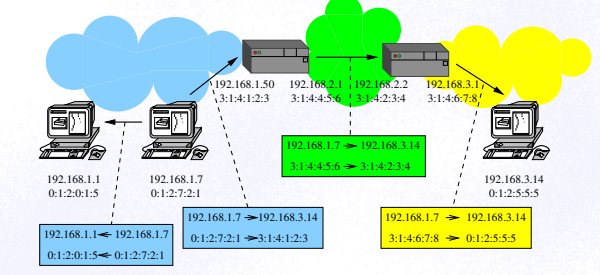

# ASU - Podstawowa wiedza

# Wstęp

## Zadania administratora
- instalacja systemu,
- zakładanie i kasowanie kont użytkowników,
- zabezpieczenie systemu,
- wykonywanie kopii rezerwowych plików,
- konfigurowanie środowiska dla użytkowników,
- monitorowanie pracy systemu (**czytanie** i kasowanie logów),
- instalacja oprogramowania,
- instalacja urządzeń,
- naprawianie uszkodzeń.

## Drzewo katalogów

<details>
    <summary>man file-hierarchy</summary>
    ```
    GENERAL STRUCTURE
        /
            The file system root. Usually writable, but this is not required.

        /boot/
            The boot partition used for bringing up the system. This directory is usually strictly local to the
            host, and should be considered read-only, except when a new kernel or boot loader is installed. This
            directory only exists on systems that run on physical or emulated hardware that requires boot loaders.
        
        /etc/
            System-specific configuration. This directory may or may not be read-only. Frequently, this directory is
            pre-populated with vendor-supplied configuration files, but applications should not make assumptions about
            this directory being fully populated or populated at all, and should fall back to defaults if
            configuration is missing.

        /home/
            The location for normal user's home directories. Possibly shared with other systems, and never read-only.
            This directory should only be used for normal users, never for system users. This directory and possibly
            the directories contained within it might only become available or writable in late boot or even only
            after user authentication. This directory might be placed on limited-functionality network file systems,
            hence applications should not assume the full set of file API is available on this directory. Applications
            should generally not reference this directory directly, but via the per-user $HOME environment variable,
            or via the home directory field of the user database.

        /root/
            The home directory of the root user. The root user's home directory is located outside of /home/ in order
            to make sure the root user may log in even without /home/ being available and mounted.

        /tmp/
            The place for small temporary files. This directory is usually mounted as a "tmpfs" instance, and should
            hence not be used for larger files. (Use /var/tmp/ for larger files.) Since the directory is accessible to
            other users of the system, it is essential that this directory is only written to with the mkstemp(3),
            mkdtemp(3) and related calls. This directory is usually flushed at boot-up. Also, files that are not
            accessed within a certain time are usually automatically deleted. If applications find the environment
            variable $TMPDIR set, they should prefer using the directory specified in it over directly referencing
            /tmp/. For further details about this directory, see
            Using /tmp/ And /var/tmp/ Safely[5].

    VENDOR-SUPPLIED OPERATING SYSTEM RESOURCES
        /usr/
            Vendor-supplied operating system resources. Usually read-only, but this is not required. Possibly shared
            between multiple hosts. This directory should not be modified by the administrator, except when installing
            or removing vendor-supplied packages.

        /usr/bin/
            Binaries and executables for user commands that shall appear in the $PATH search path. It is recommended
            not to place binaries in this directory that are not useful for invocation from a shell (such as daemon
            binaries); these should be placed in a subdirectory of /usr/lib/ instead.

        /usr/include/
            C and C++ API header files of system libraries.

        /usr/lib/
            Static, private vendor data that is compatible with all architectures (though not necessarily
            architecture-independent). Note that this includes internal executables or other binaries that are not
            regularly invoked from a shell. Such binaries may be for any architecture supported by the system. Do not
            place public libraries in this directory, use $libdir (see below), instead.

        /usr/share/
            Resources shared between multiple packages, such as documentation, man pages, time zone information, fonts
            and other resources. Usually, the precise location and format of files stored below this directory is
            subject to specifications that ensure interoperability.

    PERSISTENT VARIABLE SYSTEM DATA
        /var/
            Persistent, variable system data. Must be writable. This directory might be pre-populated with
            vendor-supplied data, but applications should be able to reconstruct necessary files and directories in
            this subhierarchy should they be missing, as the system might start up without this directory being
            populated. Persistency is recommended, but optional, to support ephemeral systems. This directory might
            become available or writable only very late during boot. Components that are required to operate during
            early boot hence shall not unconditionally rely on this directory.

        /var/cache/
            Persistent system cache data. System components may place non-essential data in this directory. Flushing
            this directory should have no effect on operation of programs, except for increased runtimes necessary to
            rebuild these caches.

        /var/lib/
            Persistent system data. System components may place private data in this directory.

        /var/log/
            Persistent system logs. System components may place private logs in this directory, though it is
            recommended to do most logging via the syslog(3) and sd_journal_print(3) calls.

        /var/spool/
            Persistent system spool data, such as printer or mail queues.

        /var/tmp/
            The place for larger and persistent temporary files. In contrast to /tmp/, this directory is usually
            mounted from a persistent physical file system and can thus accept larger files. (Use /tmp/ for smaller
            files.) This directory is generally not flushed at boot-up, but time-based cleanup of files that have not
            been accessed for a certain time is applied. The same security restrictions as with /tmp/ apply, and hence
            only mkstemp(3), mkdtemp(3) or similar calls should be used to make use of this directory. If applications
            find the environment variable $TMPDIR set, they should prefer using the directory specified in it over
            directly referencing /var/tmp/ (see environ(7) for details). For further details about this directory, see
            Using /tmp/ And /var/tmp/ Safely[5].

    VIRTUAL KERNEL AND API FILE SYSTEMS
        /dev/
            The root directory for device nodes. Usually, this directory is mounted as a "devtmpfs" instance, but
            might be of a different type in sandboxed/containerized setups. This directory is managed jointly by the
            kernel and systemd-udevd(8), and should not be written to by other components. A number of special purpose
            virtual file systems might be mounted below this directory.

        /dev/shm/
            Place for POSIX shared memory segments, as created via shm_open(3). This directory is flushed on boot, and
            is a "tmpfs" file system. Since all users have write access to this directory, special care should be
            taken to avoid name clashes and vulnerabilities. For normal users, shared memory segments in this
            directory are usually deleted when the user logs out. Usually, it is a better idea to use memory mapped
            files in /run/ (for system programs) or $XDG_RUNTIME_DIR (for user programs) instead of POSIX shared
            memory segments, since these directories are not world-writable and hence not vulnerable to
            security-sensitive name clashes.

        /sys/
            A virtual kernel file system exposing discovered devices and other functionality. This file system is
            mostly an API to interface with the kernel and not a place where normal files may be stored. In
            sandboxed/containerized setups, this directory is generally mounted read-only. A number of special purpose
            virtual file systems might be mounted below this directory.

    COMPATIBILITY SYMLINKS
        /bin/, /sbin/, /usr/sbin/
            These compatibility symlinks point to /usr/bin/, ensuring that scripts and binaries referencing these
            legacy paths correctly find their binaries.

        /lib/
            This compatibility symlink points to /lib/, ensuring that programs referencing this legacy path correctly
            find their resources.

        /lib64/
            On some architecture ABIs, this compatibility symlink points to $libdir, ensuring that binaries
            referencing this legacy path correctly find their dynamic loader. This symlink only exists on
            architectures whose ABI places the dynamic loader in this path.
    ```
</details>

# Konfiguracja sieci IP


## Model ISO - OSI

| warstwa      | -            | -          | -         | -    | -   |
|--------------|--------------|------------|-----------|------|-----|
| aplikacji    | telnet       | SMTP       | FTP       | DNS  | NFS |
| prezentacji  | telnet       | SMTP       | FTP       | DNS  | XDR |
| sesji        | telnet / TCP | SMTP / TCP | FTP / TCP | DNS  | RPC |
| transportowa | TCP          | TCP        | TCP       | UDP  | UDP |
| sieciowa     | IP           | IP         | IP        | IP   | IP  |
| łącza        | Ethernet     | IEEE 802.3 | X.25      | SLIP | PPP |
| fizyczna     | Ethernet     | IEEE 802.3 | X.25      | SLIP | PPP |


## OSI packet encapsulation

Każda z warstw (oprócz aplikacji) dodaje do pakietów własny nagłówek oraz końcówkę.

| warstwa      | numer |
|--------------|-------|
| aplikacji    | 7     |
| prezentacji  | 6     |
| sesji        | 5     |
| transportowa | 4     |
| sieciowa     | 3     |
| łącza        | 2     |
| fizyczna     | 1     |


## Rozpoznawanie sąsiedztwa



## Klasy adresów IP

| klasa | początek sieci bitowo | minimalny adres | maksymalny adres | maska sieci     | przeznaczenie          |
|-------|-----------------------|-----------------|------------------|-----------------|------------------------|
| A     | 0                     | 0.0.0.0         | 127.255.255.255  | 255.0.0.0       |                        |
| B     | 10                    | 128.0.0.0       | 191.255.255.255  | 255.255.0.0     |                        |
| C     | 110                   | 192.0.0.0       | 223.255.255.255  | 255.255.255.0   |                        |
| D     | 1110                  | 224.0.0.0       | 239.255.255.255  | 255.255.255.255 | MULTICAST              |
| E     | 1111                  | 240.0.0.0       | 255.255.255.255  | 255.255.255.255 | ZAREZERWOWANE DLA IETF |

## Plik **/etc/network/interfaces**

#### Przykład:

```s
# The loopback network interface
auto lo
iface lo inet loopback

auto eth0
iface eth0 inet static
	address 194.29.180.10/27
	gateway 194.29.180.30
	dns-nameservers 194.29.180.10 194.29.180.22
	dns-search elka.pw.edu.pl

auto eth0:1
iface eth0:1 inet static
address 192.168.133.33/24

allow-hotplug 	eth1
iface eth1 inet dhcp
```


## Plik **/etc/hosts**

```s
IP-address official-host-name nicknames...
```

- IP-address - adres IP
- official-host-name - oficjalna nazwa maszyny
- nicknames - alternatywne nazwy maszyny

#### Przykład:
```s
127.0.0.1 localhost
148.81.31.9 abc.ghi.pw.edu.pl abc

# The following lines are desirable for IPv6 capable hosts
::1 localhost ip6-localhost ip6-loopback
ff02::1 ip6-allnodes
ff02::2 ip6-allrouters

148.81.31.1 csd
148.81.31.2 csd1
148.81.31.3 csd2
148.81.31.4 csd3
```

## Plik **/etc/networks**
```s
official-network-name network-number aliases
```
- official-network-name – oficjalna nazwa sieci
- network-number – numer IP sieci
- aliases – alternatywne nazwy sieci

```s
default 0.0.0.0
loopback 127.0.0.0
link-local 169.254.0.0
localnet 194.29.180.0
```


# System DNS

## Master Servers
The master name servers maintain all the data corresponding to the zone, making them the authority for that zone. These are commonly called authoritative name servers. The data corresponding to any given zone should be available on at least two authoritative servers. You should designate one name server as the primary master server and at least one more as a secondary master server, to act as a backup if the primary is unavailable or overloaded.

A server may function as a master for multiple zones: as a primary for some zones, and as a secondary for others.

### Primary Master Server (Master Authority Server)
The primary master server is the DNS name server that loads the master copy of its data from disk when it starts in.named. A zone's primary master server is where you make changes for the zone. The primary master is the source for DNS information regarding its zone. The primary server may also delegate authority to secondary servers in its zone as well as to servers outside its zone.

### Secondary Master Server (Slave Authority Server)
A secondary master server maintains a copy of the data for the zone. The primary server sends its data and delegates authority to the secondary server. Clients can query a secondary server for DNS information.By using secondary servers, you can improve response time and reduce network overhead by spreading the load over multiple machines. Secondary servers also provide redundancy in case the primary server is not available.

When the secondary server starts in.named, it requests all the data for the given zone from the primary. The secondary server then periodically checks with the primary to see if it needs to update its database. The process of sending the most recent zone database from the primary to the secondary is called a zone transfer. Thus, you do not modify data files on a secondary server, you modify the data files on the zone's primary server and the secondary servers update their files from the primary.

## Caching and Cache-only Servers
All name servers are caching servers. This means that the name server caches received information until the data expires. The expiration process is regulated by the time-to-live (TTL) field that may be attached to the data.

Additionally, you can set up a cache-only server that is not authoritative for any zone. A cache-only server is a server that is not a master server for any zone other than the in-addr.arpa. domain. A cache-only server handles the same kind of queries from clients that authoritative name servers perform. But the cache-only server does not maintain any authoritative data itself.

A cache-only server requires less memory than an authoritative server, but cannot function by itself if no primary or secondary servers are available.

## Rekord DNS

| Pole             | Opis                                                                                 |
|------------------|--------------------------------------------------------------------------------------|
| nazwa            | Nazwa rekordu. Jedną nazwę może mieć klika rekordów nawet jeśli sa tego samego typu. |
| czas życia (TTL) | Wyrażony w sekundach maksymalny czas przechowywania w serwerach buforujących.        |
| klasa            | Klasa rekordu (IN - Internet, CH - Chaos, HS - Hesiod, ??).                          |
| typ              | Typ rekordu.                                                                         |
| wartość          | Wartość rekordu zależna od jego typu.                                                |

### Typy rekordów DNS

| Typ    | Przeznaczenie              |
|--------|----------------------------|
| SOA    | początek opisu domeny      |
| NS     | serwer obsługujący domenę  |
| A      | adres IP v.4               |
| AAAA   | adres IP v.6               |
| PTR    | odsyłacz do innego rekordu |
| CNAME  | nazwa alternatywna         |
| MX     | serwer pocztowy            |
| TXT    | dowolny tekst              |
| SRV    | serwer usługi              |
| DNSKEY | klucz serwera              |
| RRSIG  | podpis rekordu             |
| HINFO  | informacje o komputerze    |
| WKS    | oferowane usługi           |


### SOA - parametry buforowania informacji o domenie

| Nazwa   | Przykład   | Opis                                                                                                                                    |
|---------|------------|-----------------------------------------------------------------------------------------------------------------------------------------|
| Serial  | 2022111100 | Numer sekwencyjny - zawsze musi rosnąć! Zalecany format: YYYYMMDDnn Dozwolona kropka w numerze jednak nie zalecana (numery mogą maleć)! |
| Refresh | 10800      | Co ile sekund należy sprawdzać aktualność danych.                                                                                       |
| Retry   | 3600       | Co ile sekund należy ponawiać nieudaną próbę.                                                                                           |
| Expire  | 432000     | Po ilu sekundach dane należy uznać za nieaktualne.                                                                                      |
| Minimum | 86400      | Minimalny czas przechowywania.                                                                                                          |


## DNS dla IP v4

yxz IN A 1.2.3.4

## Revers DNS dla IP v4

4.3.2.1.IN-ADDR.ARPA.

## DNS dla IP v6
xyz IN AAAA 1080:0000:0000:0000:0008:0800:200C:417A
xyz IN AAAA 1080::8:800:200C:417A

## Revers DNS dla IP v6
A.7.1.4.C.0.0.2.0.0.8.0.8.0.0.0.0.0.0.0.0.0.0.0.0.0.0.0.0.8.0.1.IP6.ARPA


# Konta użytkowników

## Plik /etc/passwd
```s
username:[password]:uid:gid:[gcos-field]:home-dir:login-shell
```
- username – identyfikator użytkownika (małe litery i cyfry, pierwsza litera, do 8 znaków)
- password – zaszyfrowane hasło użytkownika (##username - security C2, x - shadow, * - blokada)
- uid – numeryczny identyfikator użytkownika (0..32767)
- gid – numeryczny identyfikator grupy (0..32767)
- gcos-field – imie i nazwisko użytkownika + ew. telefon, nr pokoju itp.
- home-dir – katalog prywatny użytkownika
- login-shell – interpreter komend (musi figurować w /etc/shells: valid login shells)

## Plik /etc/shadow
```s
username:password:lastchg:min:max:warn:[inactive]:[expire]:[flag]
```
- username – identyfikator użytkownika
- password – zaszyfrowane hasło (13 znakow)
- lastchg – data ostaniej zmiany hasła
- min – minimalny okres pomiędzy zmianami hasła (dni)
- max – maksymalny okres pomiędzy zmaianami hasła (dni)
- warn – na ile dni przed upływem terminu przypominać o zmianie hasła
- inactive – maksymalny okres nieaktywności użytkownika
- expire – termin ważności konta
- flag – 0 (zarezerwowoane na przyszłość)


## Plik /etc/group
```s
groupname:[password]:gid:[user-list]
```
- groupname – nazwa grupy
- password – opcjonalne hasło (zaszyfrowane)
- gid – numeryczny identyfikator grupy
- user-list – lista użytkowników oddzielona przecinkami


## Polecenia
```s
su [-] [user [arg]]
```
switch user
- -c - perform command as user

```s
newgrp [-] [group]
```
new group

```s
useradd [opcje] loginnname
```
Opcje:
- -d home – ścieżka do katalogu użytkownika
- -c gcos – pełne imię, nazwisko i inne informacje
- -g group – podstawowa grupa do której użytkownik ma należeć
- -G g1, g2, ... – lista grup do których użytkownik ma należeć
- -u uid – numeryczny identyfikator użytkownika
- -s shell – pełna ścieżka do powłoki użytkownika
- -k skel – ścieżka do katalogu zawierającego prototypowe pliki konfiguracyjne
- -o – uid nie musi być unikalne

```s
usermod [opcje] loginnname
```
Opcje:
- -d home – ścieżka do katalogu użytkownika
- -c gcos – pełne imie, nazwisko i inne informacje
- -g group – podstawowa grupa do której użytkownik ma należeć
- -G g1, g2, ... – lista grup do których użytkownik ma należeć
- -u uid – numeryczny identyfikator użytkownika
- -s shell – pełna ścieżka do powłoki użytkownika
- -o – uid nie musi być unikalne

```s
userdel [-r] loginnname
```
Opcje:
- -r – katalog użytkownika należy skasować wraz z całą zawartością

# Usługa LDAP


Generalnie BSS i /etc/nsswitch.conf

# Procesy

## fork()
```s
$pid=fork();
if ($pid == 0)
{ ........ child ......... }
elsif ($pid > 0)
{ ........ parent ......... }
else
{ ........ error ......... }
```

Procedura `fork()` tworzy kopię procesu głównego.

Kopiowane są dane procesu (proces rodzic i dziecko korzystają z programu zapisanego w tym samym miejscu w pamięci).

## exec()

Procedura `exec()` zastępuje pamięć programu oraz pamięć danych danymi z wywoływanego procesu.

## Sygnały

```s
SIGHUP  1  – hangup
SIGINT  2  – interrupt (rubout)
SIGQUIT 3  – quit (ASCII FS)
SIGILL  4  – illegal instruction (not reset when caught)
SIGTRAP 5  – trace trap (not reset when caught)
SIGIOT  6  – IOT instruction
SIGABRT 6  – used by abort, replace SIGIOT in the future
SIGEMT  7  – EMT instruction
SIGFPE  8  – floating point exception
SIGKILL 9  – kill (cannot be caught or ignored)
SIGBUS  10 – bus error
SIGSEGV 11 – segmentation violation
SIGSYS  12 – bad argument to system call
SIGPIPE 13 – write on a pipe with no one to read it
SIGALRM 14 – alarm clock
SIGTERM 15 – software termination signal from kill
SIGUSR1 16 – user defined signal 1
```

## Komenda – crontab
```s
crontab [ filename ]
crontab -e [username]
crontab -r [username]
crontab -l [username]
```

```s
minuta godzina dzień miesiąc dzień tygodnia komenda
```
- minuta – 0..59
- godzina – 0..23
- dzień (miesiąca) – 1..31
- miesiąc – 1..12
- dzień tygodnia – 0..6 (0=Niedziela, 1=Poniedziałek, ...)

Przykłady:
```s
#minuta     godzina     dzień   miesiąc     dzień tygodnia  komenda
@reboot                                                     echo "Jak dobrze wstac ..."
0           12          1       *           *               echo "Pierwszy - idz po wyplate"
0           12          *       *           5               echo "Jutro Sobota!"
0           *           *       *           *               kuku
*/15        *           *       *           *               bam
0           12          *       7-8         *               echo "Wakacje!"
0           12          *       1,4,7,10    *               echo "Poczatek kwartalu"
```
